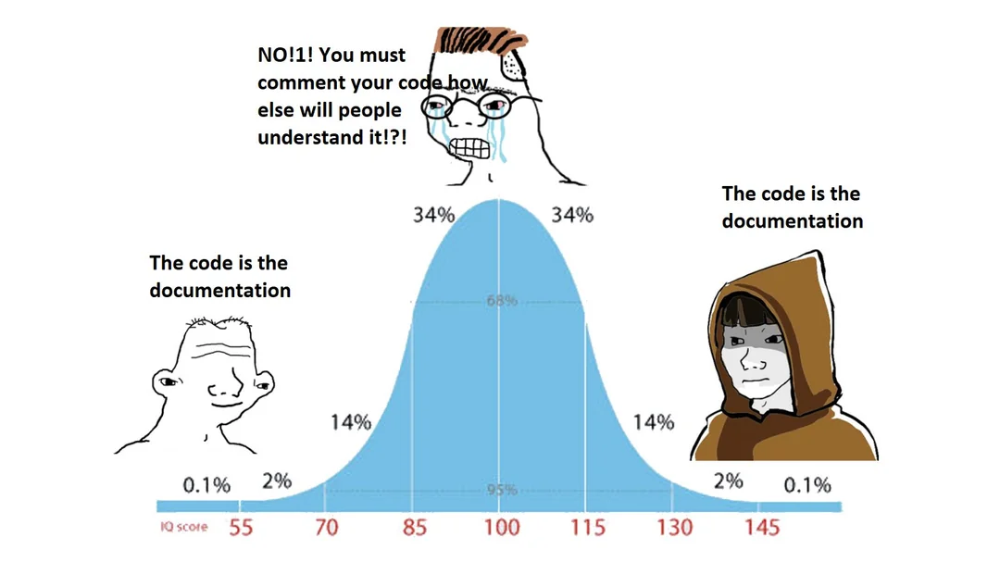

# Discord Notification Sender

A Rust library for sending rich notifications to Discord channels using webhooks. This library provides a simple yet powerful API for sending both basic and advanced notifications.

## Features

- Simple API for sending notifications with minimal setup
- Support for rich embeds with customizable colors and images
- Automatic handling of Discord API authentication
- Built with the latest Rust dependencies (reqwest 0.12, tokio 1.45)
- Environment variable support through dotenv
- Pretty-printed bot details for better debugging
- Testable API with mock support

## Installation

Add this to your `Cargo.toml`:

```toml
[dependencies]
discord_notify = "0.3.1"
```

## Usage

### Basic Notification

```rust
use discord_notify::DiscordBot;

#[tokio::main]
async fn main() {
    // Ensure you have a .env file with a valid DISCORD_TOKEN
    let channel_id = "<YOUR CHANNEL ID>";
    let identifier = "My Discord Bot";
    let bot = DiscordBot::new(identifier, channel_id);

    if let Err(e) = bot.send_notification("Hello from the Discord Notification Sender!").await {
        eprintln!("Failed to send notification: {}", e);
    }
}
```

### Advanced Notification with Embeds

```rust
use discord_notify::DiscordBot;

#[tokio::main]
async fn main() {
    let channel_id = "<YOUR CHANNEL ID>";
    let bot = DiscordBot::new("Advanced Bot", channel_id);

    // Send a notification with a custom title, description, color, and image
    if let Err(e) = bot.send_advanced_notification(
        "Important Announcement",
        "This is a detailed message with rich formatting",
        0x3498db, // Blue color in hexadecimal
        Some("https://example.com/image.png") // Optional image URL
    ).await {
        eprintln!("Failed to send advanced notification: {}", e);
    }
}
```

## Environment Variables

The library requires a Discord bot token to be set in the environment or in a `.env` file:

```
DISCORD_TOKEN=your_discord_bot_token_here
```


